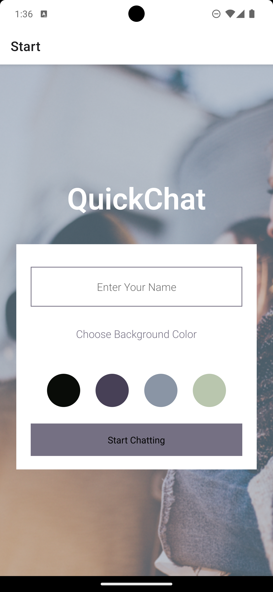
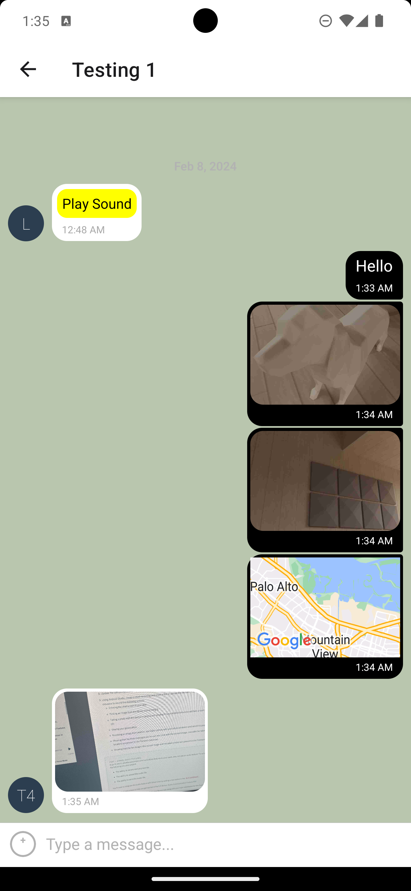
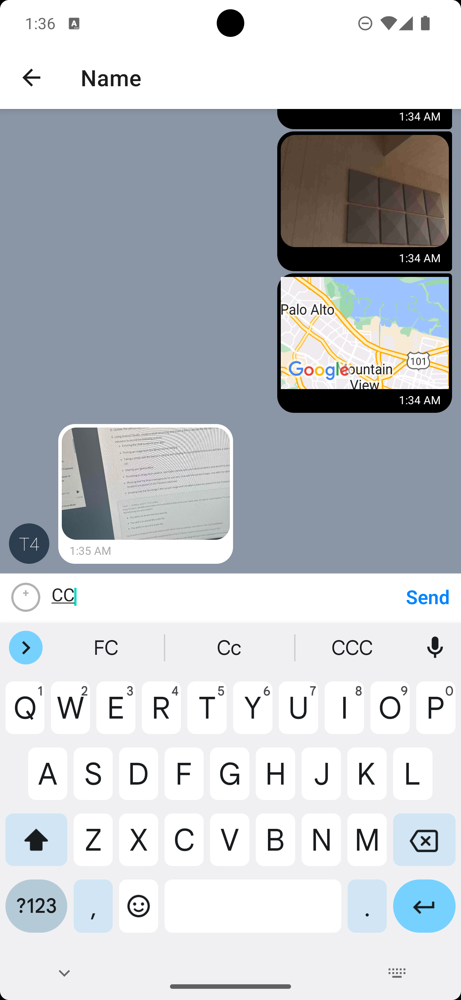

# QuickChat

A cross-platform mobile chat app built with React Native and Expo. Users pick a
name and a chat background, then send text, photos (from the library or the
camera), their current location and voice recordings. Messages sync in real time
through Firebase, and the last messages are cached on the device so the chat can
still be read offline.

<p>
  
  
  
</p>

## Features

- Anonymous sign-in with Firebase Authentication (kept between launches)
- Real-time messages with Cloud Firestore
- Send photos from the library or camera, your location (shown on a map), and voice recordings
- Images and audio stored on Cloudinary
- Offline mode: cached messages are shown and the input is hidden while disconnected

## Built with

- React Native 0.86, React 19, Expo SDK 57
- React Navigation 7
- react-native-gifted-chat
- Firebase (Authentication, Cloud Firestore)
- Cloudinary (image and audio uploads)
- expo-image-picker, expo-location, expo-audio, react-native-maps

## Running the app

You need [Node.js](https://nodejs.org/) 24 (the version is pinned in `.nvmrc`)
and the **Expo Go** app on your phone
([iOS](https://apps.apple.com/app/expo-go/id982107779) /
[Android](https://play.google.com/store/apps/details?id=host.exp.exponent)).

```bash
npm install
npx expo start
```

Scan the QR code with your phone (on the same Wi-Fi as your computer) to open the
app in Expo Go. Press `i` or `a` in the terminal to open the iOS Simulator or an
Android emulator instead.

## Using your own backend

The app is configured for my Firebase and Cloudinary accounts. To use your own:

1. **Firebase:** create a project at [firebase.google.com](https://firebase.google.com/),
   enable **Anonymous** sign-in under Authentication, and create a Cloud Firestore
   database. Use rules that only allow signed-in users:

   ```
   rules_version = '2';
   service cloud.firestore {
     match /databases/{database}/documents {
       match /messages/{message} {
         allow read, create: if request.auth != null;
       }
     }
   }
   ```

   Then register a web app and replace `firebaseConfig` in `App.js`.

2. **Cloudinary:** create a free account at [cloudinary.com](https://cloudinary.com/)
   and an **unsigned** upload preset (Settings → Upload → Upload presets). Limit it
   to a folder, image and audio formats, and a maximum file size. Then set
   `CLOUDINARY_CLOUD_NAME` and `CLOUDINARY_UPLOAD_PRESET` in `utils/uploadFile.js`.
